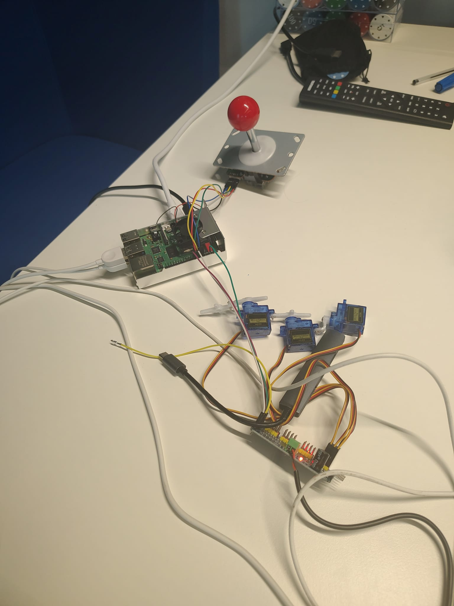

# Project Echo - Linux Kernel Teach & Replay Robot Driver

A custom Linux loadable kernel module (LKM) character device driver that controls a 3-axis pan/tilt servo mount on a Raspberry Pi 4. A 4-way joystick lets you **teach** the robot a sequence of movements, which are recorded into a ring buffer and then **replayed** back automatically — all driven from kernel space with proper blocking I/O, threaded hardware interrupts, and I2C servo communication.

> Built as part of ISE Block 3 — Team 9

## Demo


## Hardware Setup

<p align="center">
  
</p>

---

## What It Does

1. **Teach Mode** — Press a direction on the joystick and the servos move in real time. Every movement is timestamped and recorded into a 256-entry kernel ring buffer (kfifo).
2. **Auto-Replay** — Stop touching the joystick for 5 seconds and the robot replays every recorded movement with the original timing, driven by a kernel workqueue.
3. **User-Space Control** — An ncurses terminal application provides a live dashboard with servo angle bar graphs, buffer fill level, and keyboard controls for mode switching, speed adjustment, and reset.

The entire system works through the standard Linux device interface — `open()`, `read()`, `write()`, `ioctl()` — meaning any program can talk to the robot through `/dev/echo_robot`.

---

## Architecture

The module is compiled from **7 source files** into a single `echo_robot.ko`, with each subsystem fully decoupled via callback-based ops structs:

```
┌──────────────────────────────────────────────────────────┐
│                    echo_main.c                           │
│              (coordinator & ops wiring)                   │
├──────────┬──────────┬──────────┬──────────┬──────────────┤
│ joystick │  state   │  buffer  │  servo   │   chardev    │
│ (GPIO    │ (FSM &   │ (kfifo & │ (I2C /   │ (/dev node   │
│  IRQs)   │  timer)  │ replay)  │ PCA9685) │  + blocking) │
└──────────┴──────────┴──────────┴──────────┴──────────────┘
                                                 │
                                          ┌──────┴──────┐
                                          │  echo_proc  │
                                          │(/proc stats)│
                                          └─────────────┘
```

**Data flow:**
```
Joystick IRQ → State Machine → Servo (move) + Buffer (record)
                                    ↑
User App (write REPLAY) → Buffer → Replay Worker → Servo (playback)
                          blocks until done ──────→ wake writer
```

---

## Key Technical Highlights

### Kernel Module

| Feature | Detail |
|---|---|
| **Character Device** | `/dev/echo_robot` with `open`, `close`, `read`, `write`, `ioctl` |
| **Blocking I/O** | `read()` blocks on a wait queue until new state is available; `write(REPLAY)` blocks until the full replay sequence completes |
| **Threaded IRQs** | GPIO interrupts with hardware-level falling-edge triggers and 50ms software debounce |
| **kfifo Ring Buffer** | Lock-free 256-entry circular buffer recording timestamped servo movements |
| **Kernel Workqueue** | Dedicated single-thread workqueue replays movements with adjustable speed (1x, 2x, ...) |
| **Inactivity Timer** | Kernel timer auto-transitions from TEACH to REPLAY after 5 seconds of silence |
| **I2C / PCA9685** | 16-channel PWM driver at 50 Hz; integer-only angle-to-pulse conversion (no kernel floats) |
| **Proc Interface** | `/proc/echo_stats` exposes live mode, angles, buffer fill, move/replay/IRQ counts |
| **Simulation Mode** | Full operation without hardware — all GPIO/I2C calls replaced with `pr_info()` logging |
| **Concurrency** | Spinlocks (irqsave), seqlocks, mutexes, atomics, and wait queues — chosen per access pattern |

### User-Space Application

| Feature | Detail |
|---|---|
| **ncurses Dashboard** | Live-updating terminal UI with servo angle bar graphs and system stats |
| **poll()-Based I/O** | Non-blocking event loop using `poll()` on the device file descriptor |
| **Multi-Threaded Replay** | Detached pthread for blocking replay writes so the UI stays responsive |
| **Keyboard Control** | Switch modes, trigger replay, adjust speed, reset — all from the terminal |

---
 
## Hardware

- **Raspberry Pi 4** (Broadcom BCM2711)
- **PCA9685** 16-channel PWM driver over I2C (bus 1, address 0x40)
- **3 servo motors** — Pan (base rotation), Tilt (arm 1), Tilt2 (arm 2, mirrors pan)
- **4-way joystick** — Active-low with pull-ups, common pin to GND

### GPIO Pin Mapping (Pi 4)
 
| Direction | BCM Pin | Kernel GPIO (BCM + 512) | Servo | Action |
|---|---|---|---|---|
| UP | 17 | 529 | Tilt | +5 degrees |
| DOWN | 27 | 539 | Tilt | -5 degrees |
| LEFT | 22 | 534 | Pan | -5 degrees |
| RIGHT | 23 | 535 | Pan | +5 degrees |

> The +512 offset is specific to the Pi 4's `pinctrl-bcm2711` GPIO chip.

---

## Building & Running

### Prerequisites

```bash
# Kernel headers (for module compilation)
sudo apt install raspberrypi-kernel-headers

# App dependencies
sudo apt install libncurses-dev
```

### Build

```bash
# Kernel module
cd module && make

# User-space app
cd app && make
```

### Load & Run

```bash
# Load module (simulation mode by default)
sudo scripts/load_module.sh

# For real hardware:
sudo scripts/load_module.sh sim_mode=0

# Run the app
./app/echo_app

# Check kernel stats
cat /proc/echo_stats

# Unload when done
sudo scripts/unload_module.sh
```

### Module Parameters

| Parameter | Default | Description |
|---|---|---|
| `sim_mode` | `true` | Skip hardware init, log to dmesg instead |
| `timeout_ms` | `5000` | Inactivity timeout before auto-replay (ms) |
| `gpio_up` | `529` | GPIO number for UP direction |
| `gpio_down` | `539` | GPIO number for DOWN direction |
| `gpio_left` | `534` | GPIO number for LEFT direction |
| `gpio_right` | `535` | GPIO number for RIGHT direction |

---

## Device Interface

### Character Device (`/dev/echo_robot`)

**Write commands** (via `struct echo_cmd`):
- `TEACH` — Enter teach mode
- `REPLAY` — Start replay (blocks until complete)
- `STOP` — Return to idle
- `MOVE` — Direct servo control (servo_id, angle)

**Read** (via `struct echo_snapshot`):
- Blocks until new data is available (or `EAGAIN` with `O_NONBLOCK`)
- Returns current mode, all servo angles, buffer count, move/replay/IRQ stats

**ioctl**:
- `ECHO_IOC_SET_SPEED` — Set replay speed multiplier
- `ECHO_IOC_RESET` — Stop, clear buffer, center all servos
- `ECHO_IOC_GET_STATE` — Non-blocking state query
- `ECHO_IOC_SET_MODE` — Explicit mode change

---

## Project Structure

```
Team9OSDriver/
├── module/                 # Kernel module (compiles to echo_robot.ko)
│   ├── echo_main.c         # Module init/exit, subsystem wiring
│   ├── echo_chardev.c      # /dev/echo_robot file operations
│   ├── echo_servo.c        # I2C/PCA9685 servo control
│   ├── echo_joystick.c     # GPIO interrupt handling
│   ├── echo_state.c        # State machine + inactivity timer
│   ├── echo_buffer.c       # kfifo ring buffer + replay workqueue
│   ├── echo_proc.c         # /proc/echo_stats interface
│   ├── echo_types.h        # Shared enums and constants
│   ├── echo_ioctl.h        # Kernel/user-space shared command structs
│   └── Makefile
├── app/                    # User-space ncurses application
│   ├── echo_app.c          # Main loop (poll + ncurses + signals)
│   ├── echo_controller.c   # Keyboard input → device commands
│   ├── echo_visualizer.c   # ncurses rendering
│   └── Makefile
├── scripts/
│   ├── load_module.sh      # insmod + device node setup
│   ├── unload_module.sh    # rmmod + cleanup
│   └── test_blocking.sh    # Automated stress tests
└── Brief.md                # Assignment specification
```

---

## Testing  .  

```bash
# Run the automated test suite
sudo scripts/test_blocking.sh
```

Tests cover:
- Device node and `/proc` entry existence
- Concurrent readers (5 parallel processes)
- Rapid open/close cycles (50 iterations)
- Non-blocking read behavior (`EAGAIN`)
- Kernel log integrity (no oops/bugs/errors)

---

## Team

**Team 9** — ISE Block 3, 2026
